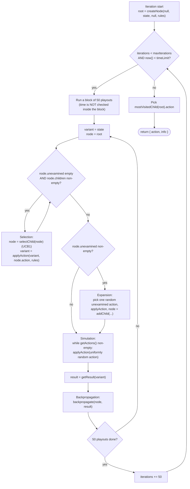
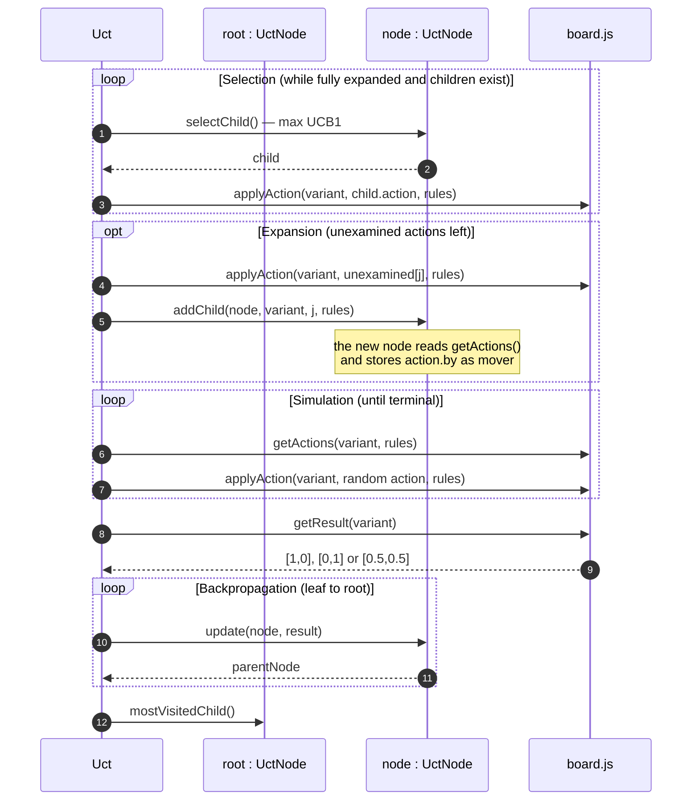
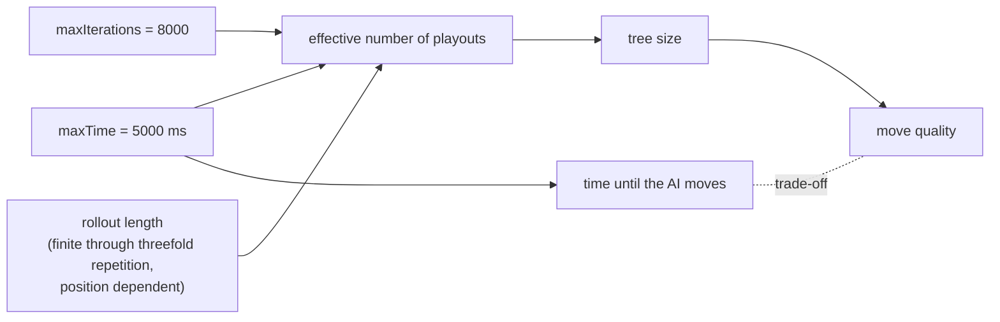

# UCT / MCTS Engine — Mulino (Nine Men's Morris)

This document describes the AI engine of the Mulino project, implemented in:

* [html5/src/js/engine/uct.js](../html5/src/js/engine/uct.js) — search loop, tree nodes, UCB1, backpropagation
* [html5/src/js/engine/random.js](../html5/src/js/engine/random.js) — alternative baseline provider
* [html5/src/js/worker/controller.js](../html5/src/js/worker/controller.js) — search budgets and invocation
* [html5/src/js/core/board.js](../html5/src/js/core/board.js) — the Morris model the search runs on

For the surrounding system structure, the Web Worker boundary, the message
protocol and the HMI, see [software_architecture.md](software_architecture.md),
in particular section 5.4 (UCT activity diagram), section 6.5 (AI move sequence)
and section 9.1 (threading). For the game rules the search obeys, see
[rules.md](rules.md).

> **Status note.** The engine is game-agnostic:
> it only talks to the model through `getActions`,
> `applyAction`, `getResult` and the `by` field of an action. Everything that
> is specific to Nine Men's Morris — placing, moving, flying, mills and
> removals — lives in the model. The one engine change of the port scores every
> node for the player who moved there (section 2.4). Ideas that are not
> implemented are kept, clearly marked, in section 9.

---

## 1. Engine entry point

```js
export const getActionInfo = (state, {
  maxIterations, maxTime, rules,
  random = Math.random, now = Date.now, blockSize = BLOCK_SIZE
}) => ({ action, info })
```

Input contract — `state` is a plain board state value; the search calls the pure
functions of [board.js](../html5/src/js/core/board.js):

| Function | Used for |
| --- | --- |
| `getActions(state, rules)` | legal actions of a state: placements, moves, flights, or — while `pendingRemoval` is set — only removals |
| `applyAction(state, action, rules)` | the successor state; keeps the turn after an action that closes a mill, unless the optional rule leaves nothing to remove |
| `getResult(state)` | terminal scoring, `[1, 0]` or `[0, 1]` for a win, `[0.5, 0.5]` for a threefold-repetition draw |
| `action.by` | the player who made an action, stored as `mover` in every node |

Because the model is immutable, no board copy is needed: a playout just
walks from one state value to the next.

A turn that closes a mill is two actions in the tree: the place / move / fly
edge followed by a remove edge of the same player. The engine therefore
searches removals exactly like any other action; there is no separate removal
search.

Return value:

```js
{ action: Action | null,   // mostVisitedChild(root).action
  info:   'N nodes/sec examined.' }
```

Behaviour and preconditions:

* A terminal position yields `action: null`; the controller then only redraws.
* A single legal action is **not** short-circuited; the full budget is still
  spent. This matters for Nine Men's Morris, where a removal with only one
  candidate or a blocked position with one move is common.
* `random` and `now` are injected, which makes the search reproducible under
  test; the defaults are `Math.random` and `Date.now`.
* The returned `action` is taken from the model's own action list, so the
  controller can apply it directly with `applyAction()`.

Invocation in [controller.js](../html5/src/js/worker/controller.js):

```js
const actionInfo = search(state, {
  maxIterations: MAX_ITERATIONS, maxTime: MAX_TIME, rules
});
```

with `MAX_ITERATIONS = 8000` and `MAX_TIME = 5000`, i.e. **White and Black use
the same budget**. `search` is a constructor parameter of `createController`,
which is how the tests substitute a deterministic engine.

---

## 2. The four UCT phases in this codebase



Data flow of one playout:



### 2.1 Selection

`selectChild()` is entered only while the node is **fully expanded**
(`unexamined.length === 0`) and has children. There is no depth limit; selection
descends as deep as the tree currently reaches. It returns `null` for a node
without children.

### 2.2 Expansion

Exactly **one** node is added per playout. The action is drawn uniformly at
random from `unexamined` and removed from it by `addChild()` via `splice()`.

Typical branching factors of Nine Men's Morris, which bound how many playouts
are needed before a node becomes fully expanded:

| Phase | Branching factor |
| --- | --- |
| Placing | number of empty points, 24 down to 7 |
| Removing | opponent pieces outside mills, at most 9 |
| Moving | own pieces × adjacent empty points, typically 5–15 |
| Flying | 3 × empty points, up to 3 × 18 = 54 |

### 2.3 Simulation

The rollout is uniformly random and runs to a **true terminal position** — there
is no rollout depth cap and no heuristic bias. `nodesVisted` counts only these
rollout steps and feeds the `nodes/sec` diagnostic string.

> Risk: rollouts can be long, but they always end. The threefold-repetition
> rule of rules.md makes every game finite, because the number of positions is
> finite and each may occur at most three times. Still, in the moving phase
> random play can shuffle pieces back and forth for many plies before a
> position repeats for the third time, and a flying endgame of 3 against 3
> pieces with `rules.flying` enabled can last even longer because every piece
> reaches every empty point. A rollout ends once a side is reduced to fewer
> than 3 pieces, is blocked, or a position occurs for the third time. See
> backlog item 1.

### 2.4 Backpropagation

```js
export const update = (node, result) => {
  node.visits += 1;
  if (node.mover !== null) node.wins += 1 - result[node.mover];
};
```

`mover` is the player who made the action leading **into** the node, captured
at construction time from `action.by`; the root has none. `getResult()` marks
the side to move at the terminal position — the side with fewer than 3 pieces
or *no* legal action, i.e. the **loser** — with `1`, so `1 - result[mover]`
is `1` for a win of the mover, `0` for a loss and `0.5` for a
threefold-repetition draw.

Consequently `wins/visits` of a child expresses "how often this action won for
the player who chose it", which is precisely the quantity the parent's mover
wants to maximise in `selectChild()`.

> **Why the mover and not the side to move.** After an action that closes a
> mill the turn does *not* change (`applyAction()` keeps it and sets
> `pendingRemoval`), so the child's side to move equals the parent's. Scoring
> by the side to move would evaluate exactly
> these mill-closing edges from the opponent's perspective and make the AI
> avoid mills. Scoring by the mover of the incoming edge is correct for every
> edge, whether or not the turn changes. `uct.test.js › closes an available
> mill` pins this behaviour.

---

## 3. UCB formula

`selectChild()` evaluates for every child:

$$
UCB1 = \frac{w_i}{n_i} + \sqrt{\frac{2\ln N}{n_i}}
$$

with $w_i$ = `child.wins`, $n_i$ = `child.visits` and $N$ = `this.visits`
(the parent's visit count).

Notes:

* The exploration constant is hard-coded as $\sqrt{2}$, embedded in the literal
  `2` under the square root. It is not configurable at runtime.
* Children are always visited at least once before selection can reach them
  (expansion precedes selection), so no division by zero occurs.
* Ties are resolved by iteration order: the *first* child with the strictly
  greatest value wins.

The final move choice is **most-visited**, not best-value: `mostVisitedChild()`
returns the child with the highest `visits`, the first one on ties, and `null`
for a root without children.

---

## 4. Parameters

Two parameters influence the search, plus three injection points that exist for
testability (`random`, `now`, `blockSize`).

### `maxIterations` (currently `8000`)

Upper bound on the number of playouts. It is a ceiling, not a promise: the loop
counter advances in steps of `blockSize` (50 by default), so the effective
number of playouts is the smaller of `maxIterations` rounded up to a multiple of
the block size, and whatever fits into `maxTime`.

### `maxTime` (currently `5000` ms)

Wall-clock budget. The condition `now() < timeLimit` is checked **only between
blocks**, therefore:

* on slow devices the search can overshoot `maxTime` by up to the duration of one
  block;
* `maxTime` is the binding limit in practice on mobile hardware, while
  `maxIterations` binds on fast desktops.

### Interaction



Because the engine runs in the Web Worker (see
[software_architecture.md](software_architecture.md) section 9.1), `maxTime` only
delays the move animation. The UI thread stays responsive throughout: the sidebar
menu and the full-screen Rules, Options and About subpages remain fully usable
while the AI is thinking.

---

## 5. Alternative provider: `random`

```js
export const getActionInfo = (state, { rules, random = Math.random }) => ({ action, info })
```

Picks one uniformly random legal action and reports
`'Random select out of N available actions.'`, or `null` for a terminal
position. It shares the `getActionInfo` shape with the UCT engine, so it is a
drop-in replacement for the `search` parameter of `createController` — but no
request selects it at runtime. It is useful as a strength baseline and is
covered by [tests/unit/random.test.js](../tests/unit/random.test.js).

---

## 6. Difficulty settings

**Not implemented.** There is no difficulty selector, no device-profile detection
and no per-side budget table in this repository. The Options subpage
([index.html](../html5/src/index.html), `#options-menu`) offers only:

* White / Black pieces played by Human or AI,
* flying with three pieces allowed or not allowed (rules.md: *"optional in
  some rule sets"*),
* when every opponent piece stands in a mill: take one of them (default) or
  skip the removal (optional rule of rules.md),
* available move targets shown or hidden,
* algebraic board notation shown or hidden.

Of these, only the player types and the two rule flags reach the worker; see
[software_architecture.md](software_architecture.md) sections 6.1 and 8.4. The
single hard-coded budget pair `(8000, 5000)` in `Controller` is the only strength
control, and changing it requires a source edit.

---

## 7. Sides and colours

The model uses `WHITE = 0` and `BLACK = 1`, matching the black and white pieces
of [rules.md](rules.md). White starts, as stated in rules.md.
Each side starts with 9 pieces in hand and no piece on the board.

---

## 8. Validation status

The engine and the model are covered by
[tests/unit](../tests/unit), run with `npm run coverage` (Vitest, v8 provider,
96 % threshold on statements, branches, functions and lines):

| Case | Test |
| --- | --- |
| Topology: 24 points, symmetric adjacency, 16 mills, two mills per point, algebraic names | `topology.test.js` |
| Placing, mill detection, compulsory single removal also for two mills at once, mill protection, removal skip with `rules.skipRemovalInMills`, moving, flying with and without `rules.flying` | `board.test.js` |
| Terminal scoring marks the side to move as loser (fewer than 3 pieces, blocked) | `board.test.js`, `uct.test.js` |
| Threefold repetition, also non-consecutive, ends the game as a draw scored `[0.5, 0.5]` | `board.test.js`, `uct.test.js` |
| UCB1 value, selection, expansion, backpropagation for the mover (also on mill-closing edges), most-visited choice | `uct.test.js` |
| Immediate mill closure and the removal search are returned under a fixed budget | `uct.test.js` |
| Iteration and time budget both terminate the search | `uct.test.js` |
| Terminal position yields `action: null` and only a redraw | `uct.test.js`, `controller.test.js` |

Still open: a strength regression (UCT versus the random baseline over many
games) and a measurement of rollout length in moving and flying endgames.

---

## 9. Improvement backlog

Roughly ordered by value over effort. All items are proposals.

1. **Rollout depth cap** (`maxDepthSimulation`) scored as a draw `[0.5, 0.5]`.
   Threefold repetition already guarantees termination, but a cap bounds the
   cost of long moving and flying phases far below that theoretical limit.
2. **Look-ahead cap** for the total per-iteration path length, as a guard against
   very long single iterations.
3. **Difficulty presets and device-profile detection**, wired through a new
   Options group and carried on the existing `actionbyai` message alongside
   `playerwhite` / `playerblack` / `flying` / `skipRemovalInMills`.
4. **Configurable exploration constant** instead of the hard-coded $\sqrt{2}$.
5. **Time check inside the block** (or an adaptive `blockSize`) to remove the
   overshoot described in section 4.
6. **Display `actionInfo.info`** — the nodes/sec figure is computed and sent to
   the HMI, but never rendered.
7. **Transposition table** keyed by a board hash (placing order often reaches
   the same position), and light rollout heuristics such as preferring actions
   that close a mill, block an opponent two-in-a-row, or remove a piece from an
   opponent two-in-a-row.
