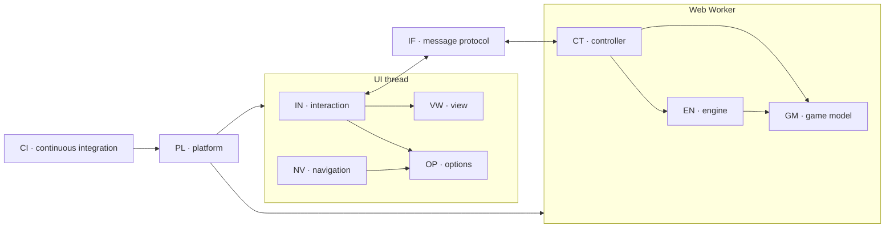

# Mulino (Nine Men's Morris) — Requirements

Functional (FR) and non-functional (NFR) requirements of the Mulino HTML5
application, arranged by architectural scope and traced to the automated tests
that verify them.

Related documents:

* Game rules for players: [rules.md](rules.md) (German: [regeln.md](regeln.md),
  French: [regles.md](regles.md), Italian: [regole.md](regole.md),
  Spanish: [reglas.md](reglas.md))
* Structure and runtime behaviour: [software_architecture.md](software_architecture.md)
* AI engine: [engine_mcts_ucb.md](engine_mcts_ucb.md)

---

## 1. Conventions

### 1.1 Identifier scheme

`FR-<scope>-<nn>` and `NFR-<scope>-<nn>`, where `<scope>` is the architectural
scope the requirement belongs to:

| Scope | Name | Realising code |
| --- | --- | --- |
| `GM` | Game model — rules and state | [core/board.js](../html5/src/js/core/board.js), [core/topology.js](../html5/src/js/core/topology.js) |
| `EN` | Engine — computer player | [engine/uct.js](../html5/src/js/engine/uct.js), [engine/random.js](../html5/src/js/engine/random.js) |
| `CT` | Controller — authoritative game session | [worker/controller.js](../html5/src/js/worker/controller.js), [worker/entry.js](../html5/src/js/worker/entry.js) |
| `IF` | Interface — HMI ↔ worker message protocol | controller and [ui/hmi.js](../html5/src/js/ui/hmi.js) |
| `VW` | View — board rendering and animation | [ui/svgBoard.js](../html5/src/js/ui/svgBoard.js) |
| `IN` | Interaction — human input and turn dispatch | [ui/hmi.js](../html5/src/js/ui/hmi.js) |
| `NV` | Navigation — pages, sidebar, subpages | [ui/navigation.js](../html5/src/js/ui/navigation.js), [ui/controls.js](../html5/src/js/ui/controls.js) |
| `OP` | Options — user settings | [ui/options.js](../html5/src/js/ui/options.js) |
| `PL` | Platform — packaging, deployment, tooling | [index.html](../html5/src/index.html), [ui/main.js](../html5/src/js/ui/main.js), build-free static hosting |
| `CI` | Continuous integration — static analysis and quality gates | [biome.json](../biome.json), [.markdownlint-cli2.jsonc](../.markdownlint-cli2.jsonc), [vitest.config.js](../vitest.config.js), [.github/workflows/ci.yml](../.github/workflows/ci.yml) |

### 1.2 Requirement attributes

Every requirement carries:

* **Verification** — `T` automated test, `A` analysis/review, `I` inspection.
* **Trace** — the test that fails when the requirement is violated. Unit tests
  are given as `file › test name`, end to end tests as `e2e › test name`.

### 1.3 Scope map



---

## 2. Functional requirements

### 2.1 GM — Game model (rules)

The game model is the single authority for what is legal. It is implemented as
pure functions over an immutable state value.

| ID | Requirement | Verification | Trace |
| --- | --- | --- | --- |
| FR-GM-01 | The board has 24 points on three concentric squares connected by lines, with 32 adjacencies along the lines. Points are named `a1` … `g7` as in the algebraic notation of rules.md. | T | `topology.test.js › has twenty four points with algebraic names`, `topology.test.js › has a symmetric adjacency with thirty two edges` |
| FR-GM-02 | There are 16 mills (three points in a row along a line); every point belongs to exactly two mills. | T | `topology.test.js › knows the sixteen mills`, `topology.test.js › puts every point into exactly two mills` |
| FR-GM-03 | A game starts with an empty board and 9 pieces in each player's hand. | T | `board.test.js › starts with an empty board and nine pieces in each hand` |
| FR-GM-04 | White moves first and players alternate; passing is not possible. | T | `board.test.js › lets white place first`, `board.test.js › switches the player after an action without mill` |
| FR-GM-05 | While the side to move has pieces in hand, its action is placing one piece onto any empty point. | T | `board.test.js › offers every empty point while pieces are in hand` |
| FR-GM-06 | Closing a mill by placing, moving or flying requires removing exactly one opponent piece in the same turn; the turn is kept until the removal is done. | T | `board.test.js › keeps the turn for a removal after closing a mill`, `e2e › closes a mill and removes an opponent piece` |
| FR-GM-07 | Closing two mills at once with a single piece still removes only one piece. | T | `board.test.js › removes only one piece for two mills closed at once` |
| FR-GM-08 | A piece that is part of a mill cannot be removed unless no other opponent piece is available. | T | `board.test.js › protects pieces in a mill while others are available`, `board.test.js › allows taking from a mill when every piece is in one` |
| FR-GM-09 | With the optional rule *skip removal*, closing a mill while every opponent piece stands in a mill removes nothing and the turn passes. | T | `board.test.js › skips the removal when every piece is in a mill and the option is set` |
| FR-GM-10 | A pending removal is compulsory: only removals are offered, there is no pass. | T | `board.test.js › offers only removals while a removal is pending` |
| FR-GM-11 | Once all 18 pieces are placed, a player slides one piece along a line onto an adjacent empty point. | T | `board.test.js › slides only to adjacent empty points after placing` |
| FR-GM-12 | A mill can be opened and closed again; every closing counts as a new mill. | T | `board.test.js › counts a reformed mill again` |
| FR-GM-13 | With the flying option, a player with exactly 3 pieces and none in hand may move a piece to any empty point; without it, the player keeps sliding. | T | `board.test.js › flies with three pieces when flying is allowed`, `board.test.js › keeps sliding with three pieces when flying is forbidden` |
| FR-GM-14 | A player reduced to fewer than 3 pieces (on board plus in hand) loses. | T | `board.test.js › ends the game when a side is down to two pieces` |
| FR-GM-15 | The player to move loses when no legal action exists. | T | `board.test.js › detects a blocked side as the loser` |
| FR-GM-16 | The result of a won game marks the player to move at the terminal position as the loser. | T | `board.test.js › scores the side to move as the loser` |
| FR-GM-17 | The game is drawn when the same position (same pieces on the same points, same player to move) occurs for the third time, not necessarily consecutively. Repetitions are only counted once all pieces have been placed. A draw is scored one half for each side. | T | `board.test.js › draws on the third occurrence of a position`, `board.test.js › ignores repetitions before all pieces are placed`, `board.test.js › scores a draw as one half each` |
| FR-GM-18 | Intermediate states with a pending removal are not counted as positions for FR-GM-17. | T | `board.test.js › does not count positions with a pending removal` |
| FR-GM-19 | Applying an action yields a new state; the previous state stays unchanged. | T | `board.test.js › leaves the previous state unchanged`, `uct.test.js › descends through fully expanded nodes` |
| FR-GM-20 | Pieces are never stacked; placing, moving and flying always target an empty point. | T | `board.test.js › never targets an occupied point` |

### 2.2 EN — Engine (computer player)

| ID | Requirement | Verification | Trace |
| --- | --- | --- | --- |
| FR-EN-01 | The AI selects a legal action by Monte-Carlo tree search with UCB applied to trees. | T | `uct.test.js › closes an available mill` |
| FR-EN-02 | Selection maximises the UCB1 value `w/n + sqrt(2 ln N / n)`. | T | `uct.test.js › computes the UCB1 value`, `uct.test.js › selects the child with the greatest UCB1 value and none without children` |
| FR-EN-03 | Each playout expands exactly one node and simulates uniformly at random to a terminal position: win, loss or threefold-repetition draw. | T | `uct.test.js › expands one node and simulates to a terminal position`, `uct.test.js › counts the simulated actions of a rollout` |
| FR-EN-04 | The result is propagated from the leaf to the root and accumulated for the player who made the incoming action of each node, also on mill-closing edges where the turn does not change; a draw credits one half. | T | `uct.test.js › accumulates the result for the player who moved there`, `uct.test.js › scores the mill-closing edge for the player keeping the turn`, `uct.test.js › backpropagates up to the root`, `uct.test.js › credits a draw with one half` |
| FR-EN-05 | The move played is the most visited root child. | T | `uct.test.js › reports the most visited child`, `uct.test.js › closes an available mill` |
| FR-EN-06 | The search stops at the iteration budget or at the wall-clock budget, whichever comes first. | T | `uct.test.js › stops as soon as the time budget is spent`, `uct.test.js › defaults to a block size of fifty` |
| FR-EN-07 | A terminal position yields no action instead of an error. | T | `uct.test.js › returns no action for a finished game`, `random.test.js › returns no action when the game is over` |
| FR-EN-08 | The engine reports a diagnostic throughput string with the chosen action. | T | `uct.test.js › closes an available mill`, `random.test.js › picks the action addressed by the random source` |
| FR-EN-09 | A uniformly random provider is available as an interchangeable baseline engine. | T | `random.test.js › picks the first action for a zero sample`, `controller.test.js › lets the engine choose and apply an action` |
| FR-EN-10 | The removal after a mill is searched as an action of its own, like placing, moving and flying. | T | `uct.test.js › searches the removal as an action of its own` |

### 2.3 CT — Controller (game session)

| ID | Requirement | Verification | Trace |
| --- | --- | --- | --- |
| FR-CT-01 | The controller owns the only authoritative game state and runs inside a Web Worker. | T | `entry.test.js › registers the controller on the worker scope`, `controller.test.js › answers start with a redraw of the initial position` |
| FR-CT-02 | `start` renders the current position without changing it. | T | `controller.test.js › answers start with a redraw of the initial position` |
| FR-CT-03 | `perform` applies a human action and answers with the new position. | T | `controller.test.js › applies a human action and redraws` |
| FR-CT-04 | `actionbyai` lets the engine choose, applies the action and answers with the new position. | T | `controller.test.js › lets the engine choose and apply an action` |
| FR-CT-05 | `restart` resets to the initial position and answers `restore` followed by `redraw`. | T | `controller.test.js › restores the initial position on restart`, `e2e › starts a new game from the sidebar` |
| FR-CT-06 | The snapshot sent to the HMI contains the position, the pieces in hand, the phase, the player to move, all legal actions, whether a removal is pending, the previous action, whether a human moves next and, at game end, the winner (or a draw) and the reason. | T | `controller.test.js › describes square, hands, phase, turn, actions and who plays next`, `controller.test.js › describes a pending removal`, `controller.test.js › describes the winner, the draw and why the game ended` |
| FR-CT-07 | `nextishuman` is false for an AI player and for a finished game. | T | `controller.test.js › marks the next turn as non human for the AI and for a finished game` |
| FR-CT-08 | Unknown requests and foreign message classes are ignored without side effects. | T | `controller.test.js › ignores unknown requests and foreign message classes` |
| FR-CT-09 | The rule options *flying* and *skip removal* are applied to the model before the action is evaluated. | T | `controller.test.js › applies the rule options before evaluating an action` |
| FR-CT-10 | Each request applies exactly one action; after a mill-closing action the snapshot keeps the turn with the same player for the removal. | T | `controller.test.js › keeps the turn for the removal after a mill` |

### 2.4 IF — Message protocol

| ID | Requirement | Verification | Trace |
| --- | --- | --- | --- |
| FR-IF-01 | HMI → worker messages carry `class: 'request'` and one of `start`, `restart`, `perform`, `actionbyai`. | T | `options.test.js › builds an engine request carrying the options`, `hmi.test.js › asks the engine to start and carries the options` |
| FR-IF-02 | Every request carries the current player types and the *flying* and *skip removal* flags. | T | `hmi.test.js › asks the engine for a move when the AI is on turn` |
| FR-IF-03 | Worker → HMI messages carry `eventClass: 'request'` and one of `redraw`, `restore`. | T | `controller.test.js › restores the initial position on restart` |
| FR-IF-04 | The HMI ignores messages it does not understand. | T | `hmi.test.js › ignores foreign engine messages` |
| FR-IF-05 | All payloads are structured-clone friendly plain data. | A/T | `controller.test.js` (all cases exchange plain objects), `e2e › renders the initial position on the game page` |

### 2.5 VW — Board view

| ID | Requirement | Verification | Trace |
| --- | --- | --- | --- |
| FR-VW-01 | The board is drawn as inline SVG with view box `0 0 9 7` — a 7 × 7 board grid plus one reserve column per side — without any third party graphics library. | T | `svgBoard.test.js › draws the board, twenty four points and two reserve columns`, `e2e › renders the initial position on the game page` |
| FR-VW-02 | A piece on a model point with coordinates `(x, y)` is centred at `(x + 1.5, 6.5 − y)` with size 0.7 × 0.7. | T | `svgBoard.test.js › maps model points onto the nine by seven view box`, `svgBoard.test.js › positions the pieces` |
| FR-VW-03 | Each of the 24 points is either a piece image or a transparent target rectangle. Pieces in hand are drawn in the reserve columns, White on the left and Black on the right. | T | `svgBoard.test.js › draws the board, twenty four points and two reserve columns`, `svgBoard.test.js › shows the pieces in hand in the reserve columns` |
| FR-VW-04 | A placement moves the topmost reserve piece onto its point, a move slides the piece to the adjacent point, and a flight is a soft jump in two consecutive steps: 600 ms translation to an enlarged midpoint at scale 1.3, then 300 ms translation to the target while shrinking back to scale 1. | T | `svgBoard.test.js › animates a placement from the reserve`, `svgBoard.test.js › slides a moved piece`, `svgBoard.test.js › flies through an enlarged midpoint before settling`, `e2e › animates a placement from the reserve` |
| FR-VW-05 | A removed piece fades out and leaves the board when the animation ends. | T | `svgBoard.test.js › fades out a removed piece` |
| FR-VW-06 | The board can be reset to the initial position and synchronised with an arbitrary position including the pieces in hand. | T | `svgBoard.test.js › restores the initial position`, `svgBoard.test.js › synchronises with an arbitrary position` |
| FR-VW-07 | Target points can be made visible or invisible without moving them. | T | `svgBoard.test.js › toggles the visibility of a target point` |
| FR-VW-08 | The board image with algebraic notation can be shown or hidden. | T | `svgBoard.test.js › shows and hides the algebraic notation board`, `e2e › applies an option chosen on the options subpage` |
| FR-VW-09 | A compact, horizontally padded badge on the right of the title bar shows the active player's configured type and player label: human/AI and Player ○ (White) or Player ● (Black), followed by the pieces still in hand during placing and a scissors hint `✂` while a removal is pending. It has a dark background, rounded corners, a light-orange border and a small rotating spinner to the left of the symbol. | T | `hmi.test.js › shows the active player and configured player type in the title bar`, `hmi.test.js › shows the pieces in hand and a pending removal in the badge`, `e2e › renders the initial position on the game page`, `e2e › updates the active-player badge after a move` |
| FR-VW-10 | The last move remains highlighted in light blue after animation: its empty source has a dashed ring and its occupied target has a solid ring, both at half the selectable-source stroke width. A placement has a target ring only; a removal leaves the previous pair in place. | T | `svgBoard.test.js › marks the last move with dashed source and solid target rings`, `svgBoard.test.js › marks a placement with a target ring only`, `e2e › updates the active-player badge after a move` |
| FR-VW-11 | At game end, a celebration panel is displayed immediately below the title bar with a small gap, horizontally centred over the board. It congratulates the White or Black winner and states whether the opponent was reduced to fewer than three pieces or had no legal move, or it announces a draw by threefold repetition. The panel has 70 % opacity, rounded corners and a thin contrasting border. | T | `controller.test.js › describes the winner, the draw and why the game ended`, `svgBoard.test.js › shows and clears celebrations with their reason`, `hmi.test.js › shows the celebration for a finished game`, `e2e › shows a celebration below the title bar` |

### 2.6 IN — Interaction

| ID | Requirement | Verification | Trace |
| --- | --- | --- | --- |
| FR-IN-01 | While placing, only empty points are clickable targets. While moving or flying, only pieces that are the origin of a legal action are clickable, and each is surrounded by a light-green circular highlight while awaiting source selection. | T | `hmi.test.js › lets a human place a piece on an empty point`, `hmi.test.js › lets a human select a piece and play a move`, `e2e › renders the initial position on the game page`, `e2e › updates the active-player badge after a move` |
| FR-IN-02 | Selecting a piece darkens its green source ring, paints that ring in front of the other highlights, and offers exactly its legal target points: adjacent empty points while moving, every empty point while flying. | T | `svgBoard.test.js › marks a selectable source piece`, `hmi.test.js › lets a human select a piece and play a move`, `hmi.test.js › offers every empty point to a flying piece`, `hmi.test.js › shows the available targets when the option is set` |
| FR-IN-03 | Selecting another piece withdraws the previous selection. | T | `hmi.test.js › hides the targets of a previous selection` |
| FR-IN-04 | Choosing a target or a piece to remove sends the matching action and clears all handlers, so an action cannot be submitted twice. | T | `hmi.test.js › lets a human select a piece and play a move`, `hmi.test.js › lets a human remove a marked opponent piece` |
| FR-IN-05 | A click that matches no legal action sends nothing. | T | `hmi.test.js › ignores a click on a point that is not a legal target` |
| FR-IN-06 | After a redraw the turn is dispatched: human input, AI request, or nothing when the game is over. When the AI closes a mill, a second AI request selects its removal. | T | `hmi.test.js › asks the engine for a move when the AI is on turn`, `hmi.test.js › asks the engine again for the removal after an AI mill`, `hmi.test.js › animates a reported action before continuing the turn`, `e2e › lets the AI answer a placement in the worker` |
| FR-IN-07 | A human turn including a mill and its removal is played end to end in a real browser. | T | `e2e › closes a mill and removes an opponent piece` |
| FR-IN-08 | "New" restarts the game, drops any pending selection and closes the sidebar. | T | `hmi.test.js › restarts the game and drops the selection`, `main.test.js › starts a new game from the sidebar`, `e2e › starts a new game from the sidebar` |
| FR-IN-09 | While a removal is pending, only removable opponent pieces are clickable and each is marked with a red ring; pieces protected by a mill stay unmarked unless no other piece is available. | T | `svgBoard.test.js › marks a removable piece with a red ring`, `hmi.test.js › lets a human remove a marked opponent piece`, `e2e › closes a mill and removes an opponent piece` |

### 2.7 NV — Navigation and shell

| ID | Requirement | Verification | Trace |
| --- | --- | --- | --- |
| FR-NV-01 | Exactly one page is visible at a time: game, rules, options or about. | T | `navigation.test.js › starts on the game page`, `navigation.test.js › hides the game board when a subpage is shown` |
| FR-NV-02 | The sidebar opens from the header icon and closes through its Back item or the dismiss layer. | T | `navigation.test.js › opens the panel through the hamburger link`, `navigation.test.js › closes the panel through the back item`, `navigation.test.js › closes the panel when the dismiss layer is clicked`, `e2e › opens and closes the sidebar menu` |
| FR-NV-03 | Opening a subpage hides the game page including the board, so the subpage is full screen. | T | `e2e › shows the rules subpage full screen and hides the board` |
| FR-NV-04 | Rules and About open with the `pop` transition, Options with `slideup`. | T | `navigation.test.js › applies the configured transition classes while animating` |
| FR-NV-05 | Leaving a subpage restores the game page with the board unchanged; no engine message is exchanged. | T | `navigation.test.js › shows the board again when leaving a subpage`, `e2e › shows the rules subpage full screen and hides the board` |
| FR-NV-06 | Each subpage offers a header icon button and a bottom button, both performing a back navigation. | T | `navigation.test.js › sends back links to the browser history`, `e2e › applies an option chosen on the options subpage` |
| FR-NV-07 | The browser/device back button returns to the game page. | T | `navigation.test.js › falls back to the game page for an unknown history entry`, `e2e › returns from the about subpage through the browser back button` |
| FR-NV-08 | A page id given in the location hash opens that page on load. | T | `navigation.test.js › opens the page named in the initial location hash` |
| FR-NV-09 | Radio buttons reflect the checked option visually. | T | `controls.test.js › marks the checked option`, `controls.test.js › moves the marker when another option is chosen` |
| FR-NV-10 | Collapsible sections on the About page expand and collapse. | T | `controls.test.js › expands and collapses a section`, `e2e › returns from the about subpage through the browser back button` |
| FR-NV-11 | The game page fills the browser viewport without horizontal or vertical scrollbars; within it, the board is scaled and centred to the available space and the icon buttons scale with it. | T | `hmi.test.js › fits the board into the free area`, `hmi.test.js › clamps the icon size`, `hmi.test.js › sizes the paper, the board margin and the icons`, `main.test.js › resizes with the window`, `e2e › renders the initial position on the game page` |

### 2.8 OP — Options

| ID | Requirement | Verification | Trace |
| --- | --- | --- | --- |
| FR-OP-01 | White and Black can each be played by a human or by the AI. | T | `options.test.js › follows the radio buttons`, `hmi.test.js › asks the engine for a move when the AI is on turn` |
| FR-OP-02 | Flying with three pieces can be allowed or forbidden; allowed is the default. | T | `options.test.js › reports the shipped defaults`, `board.test.js › flies with three pieces when flying is allowed` |
| FR-OP-03 | When every opponent piece stands in a mill, a piece is taken from a mill (default) or, with the optional rule, the removal is skipped. | T | `options.test.js › reports the shipped defaults`, `board.test.js › skips the removal when every piece is in a mill and the option is set` |
| FR-OP-04 | Available target points can be shown or hidden; hidden is the default. | T | `options.test.js › reports the shipped defaults`, `hmi.test.js › shows the available targets when the option is set` |
| FR-OP-05 | The algebraic board notation can be shown or hidden; hidden is the default. | T | `options.test.js › reports the shipped defaults`, `hmi.test.js › switches on the algebraic notation board` |
| FR-OP-06 | Options are read at the moment they are needed, so a change takes effect on the next move or new game. | T | `hmi.test.js › shows the available targets when the option is set`, `e2e › applies an option chosen on the options subpage` |
| FR-OP-07 | Purely visual options never reach the game model. | A/T | `controller.test.js › applies the rule options before evaluating an action` (only `flying` and `skipRemovalInMills` are forwarded) |

### 2.9 PL — Platform

| ID | Requirement | Verification | Trace |
| --- | --- | --- | --- |
| FR-PL-01 | The application starts from `index.html` without any build step. | T | `e2e › renders the initial position on the game page` |
| FR-PL-02 | Bootstrapping wires view, worker, navigation and form controls, and requests the first render. | T | `main.test.js › wires view, engine, navigation and controls` |
| FR-PL-03 | The engine runs in a module worker created once per session. | T | `main.test.js › creates a module worker by default` |
| FR-PL-04 | Engine messages reach the view. | T | `main.test.js › redraws through the engine listener` |
| FR-PL-05 | A `noscript` fallback explains that JavaScript is required. | I | [index.html](../html5/src/index.html) |

---

## 3. Non-functional requirements

### 3.1 Performance and responsiveness

| ID | Requirement | Verification | Trace |
| --- | --- | --- | --- |
| NFR-EN-01 | An AI move takes at most 8000 playouts and about 5 s wall clock. | T | `uct.test.js › stops as soon as the time budget is spent`; budgets asserted in `controller.test.js › lets the engine choose and apply an action` |
| NFR-CT-01 | The search never blocks the UI thread; menu, subpages and resizing stay usable while the AI thinks. | A | worker boundary, [software_architecture.md](software_architecture.md) §9.1 |
| NFR-EN-02 | Every game and every random playout terminates, because each position may occur at most three times once all pieces are placed. | A | [software_architecture.md](software_architecture.md) §5, [engine_mcts_ucb.md](engine_mcts_ucb.md) §2.3 |
| NFR-VW-01 | Both phases of the soft-jump animation (placing and flying) interpolate translation and scale smoothly and linearly over 600 ms + 300 ms. | T | `svgBoard.test.js › flies through an enlarged midpoint before settling`, `e2e › animates a placement from the reserve` |
| NFR-VW-02 | Rendering scales without layout arithmetic because all geometry is expressed in board units. | T | `svgBoard.test.js › maps model points onto the nine by seven view box` |

### 3.2 Compatibility and portability

| ID | Requirement | Verification | Trace |
| --- | --- | --- | --- |
| NFR-PL-01 | Runs on desktop and mobile browsers supporting ES modules, module workers and inline SVG. | T | `e2e` suite (Chromium); `playwright.config.js` project list |
| NFR-PL-02 | Deployable as plain static files; no server-side logic, no network access at runtime. | I | [tools/serve.js](../tools/serve.js) serves `html5/src` unmodified |
| NFR-PL-03 | Works offline once loaded; the rules text is inlined into the application. | I | [index.html](../html5/src/index.html) rules page |
| NFR-PL-04 | No persistent storage; no user data leaves the device. | A | no storage or network API is used outside asset loading |

### 3.3 Look and feel

| ID | Requirement | Verification | Trace |
| --- | --- | --- | --- |
| NFR-VW-03 | The visual design of the previous jQuery Mobile based release is preserved exactly (dark swatch, bars, listview, buttons, icon discs, radio groups, transitions). | I | [css/theme.css](../html5/src/css/theme.css) values taken verbatim from jQuery Mobile 1.4.5 |
| NFR-VW-04 | Board, background and icon buttons keep their previous proportions and scaling behaviour. | T | `hmi.test.js › sizes the paper, the board margin and the icons` |

### 3.4 Maintainability

| ID | Requirement | Verification | Trace |
| --- | --- | --- | --- |
| NFR-GM-01 | Rules and engine are pure functions over immutable values; no shared mutable state. | A | [core/board.js](../html5/src/js/core/board.js), [engine/uct.js](../html5/src/js/engine/uct.js) |
| NFR-GM-02 | The model has no knowledge of the view; the controller has no DOM access. | A | worker boundary makes the violation impossible |
| NFR-PL-05 | Source is written as ES modules with no third party runtime dependency. | I | [index.html](../html5/src/index.html), `package.json` has `devDependencies` only |
| NFR-PL-06 | Adjacency and mill tables are derived from the board geometry rather than hand-maintained. | T | `topology.test.js › derives the adjacency from the drawn lines`, `topology.test.js › derives the mills from the drawn lines` |

### 3.5 Testability and quality gates

| ID | Requirement | Verification | Trace |
| --- | --- | --- | --- |
| NFR-QA-01 | Statement, branch, function and line coverage of `html5/src/js/**` is at least 96 %. | T | `npm run coverage`, thresholds in [vitest.config.js](../vitest.config.js) |
| NFR-QA-02 | Time, randomness and completion scheduling are injectable so unit tests do not depend on real timers; browser animation interpolation is verified end to end. | A/T | `uct.test.js` (`random`, `now`), `svgBoard.test.js` and `navigation.test.js` (`schedule`), `e2e › animates a placement from the reserve` |
| NFR-QA-03 | The whole application is exercised in a real browser. | T | `e2e` suite, [playwright.config.js](../playwright.config.js) |
| NFR-QA-04 | The board topology is pinned by tests against the board diagram of rules.md. | T | `topology.test.js › matches the board diagram of the rules` |

### 3.6 Continuous integration and static analysis

| ID | Requirement | Verification | Trace |
| --- | --- | --- | --- |
| NFR-CI-01 | The whole workspace passes linting and static code analysis without findings. Sources (JavaScript, CSS, HTML, JSON) are checked with Biome, documentation with markdownlint. | T | `npm run lint` = `biome check --error-on-warnings` + `markdownlint-cli2` |
| NFR-CI-02 | Warnings are treated as errors; findings are fixed in the source, never suppressed. No `biome-ignore`, no `markdownlint-disable` and no rule disabled to hide an existing violation. | T/I | `--error-on-warnings` in `lint:code`; no suppression comment exists in the workspace |
| NFR-CI-03 | Formatting is deterministic and enforced, so that a check on unformatted sources fails. | T | `biome check` includes the formatter; `npm run lint:code:fix` applies it |
| NFR-CI-04 | Lint, unit tests with coverage and end to end tests run as one pipeline, locally and on the build server. | T | `npm run ci`, [.github/workflows/ci.yml](../.github/workflows/ci.yml) |
| NFR-CI-05 | The linter configuration is versioned with the sources and pinned to an exact tool version. | I | [biome.json](../biome.json), [.markdownlint-cli2.jsonc](../.markdownlint-cli2.jsonc), exact `@biomejs/biome` version in `package.json` |

### 3.7 Legal

| ID | Requirement | Verification | Trace |
| --- | --- | --- | --- |
| NFR-PL-07 | All own source is MIT licensed, graphics under CC BY-NC-SA 4.0, and the licences are reachable from the About page. | I | [LICENSE](../LICENSE), About page of [index.html](../html5/src/index.html) |
| NFR-PL-08 | Third party licence attributions remain available even though no third party code is shipped. | I | About page, [README.md](../README.md) |

---

## 4. Traceability summary

### 4.1 Test suites

| Suite | File | Requirements covered |
| --- | --- | --- |
| Board topology | [tests/unit/topology.test.js](../tests/unit/topology.test.js) | FR-GM-01, FR-GM-02, NFR-PL-06, NFR-QA-04 |
| Rules and state | [tests/unit/board.test.js](../tests/unit/board.test.js) | FR-GM-03 … FR-GM-20, FR-OP-02, FR-OP-03 |
| UCT engine | [tests/unit/uct.test.js](../tests/unit/uct.test.js) | FR-EN-01 … FR-EN-08, FR-EN-10, FR-GM-19, NFR-EN-01, NFR-QA-02 |
| Random engine | [tests/unit/random.test.js](../tests/unit/random.test.js) | FR-EN-07, FR-EN-08, FR-EN-09 |
| Controller | [tests/unit/controller.test.js](../tests/unit/controller.test.js) | FR-CT-01 … FR-CT-10, FR-IF-03, FR-IF-05, FR-VW-11, FR-OP-07 |
| Worker entry | [tests/unit/entry.test.js](../tests/unit/entry.test.js) | FR-CT-01 |
| Options | [tests/unit/options.test.js](../tests/unit/options.test.js) | FR-IF-01, FR-OP-01 … FR-OP-05 |
| Board view | [tests/unit/svgBoard.test.js](../tests/unit/svgBoard.test.js) | FR-VW-01 … FR-VW-08, FR-VW-10, FR-VW-11, FR-IN-02, FR-IN-09, NFR-VW-01, NFR-VW-02 |
| Interaction | [tests/unit/hmi.test.js](../tests/unit/hmi.test.js) | FR-IN-01 … FR-IN-06, FR-IN-08, FR-IN-09, FR-IF-01, FR-IF-02, FR-IF-04, FR-VW-09 … FR-VW-11, FR-NV-11, FR-OP-04 … FR-OP-06, NFR-VW-04 |
| Navigation | [tests/unit/navigation.test.js](../tests/unit/navigation.test.js) | FR-NV-01 … FR-NV-08 |
| Form controls | [tests/unit/controls.test.js](../tests/unit/controls.test.js) | FR-NV-09, FR-NV-10 |
| Bootstrap | [tests/unit/main.test.js](../tests/unit/main.test.js) | FR-PL-02 … FR-PL-04, FR-IN-08, FR-NV-11 |
| End to end | [tests/e2e/app.spec.js](../tests/e2e/app.spec.js) | FR-PL-01, FR-VW-01, FR-VW-04, FR-VW-08 … FR-VW-11, FR-IN-01, FR-IN-07 … FR-IN-09, FR-GM-06, FR-NV-02, FR-NV-03, FR-NV-05 … FR-NV-07, FR-NV-10, FR-OP-06, NFR-VW-01, NFR-PL-01, NFR-QA-02, NFR-QA-03 |
| Static analysis | `npm run lint` (Biome, markdownlint) | NFR-CI-01 … NFR-CI-03 |
| Pipeline | `npm run ci`, [.github/workflows/ci.yml](../.github/workflows/ci.yml) | NFR-CI-04 |

### 4.2 Verification method distribution

| Method | Count | Requirements |
| --- | --- | --- |
| `T` automated test | 101 | all FR except FR-PL-05; NFR-EN-01, NFR-VW-01, NFR-VW-02, NFR-VW-04, NFR-PL-01, NFR-PL-06, NFR-QA-01 … NFR-QA-04, NFR-CI-01 … NFR-CI-04 |
| `A` analysis / review | 8 | FR-IF-05, FR-OP-07, NFR-CT-01, NFR-EN-02, NFR-PL-04, NFR-GM-01, NFR-GM-02, NFR-QA-02 |
| `I` inspection | 9 | FR-PL-05, NFR-PL-02, NFR-PL-03, NFR-PL-05, NFR-VW-03, NFR-PL-07, NFR-PL-08, NFR-CI-02, NFR-CI-05 |

### 4.3 Measuring requirement coverage

```sh
npm run lint      # Biome and markdownlint over the whole workspace
npm test          # 144 unit tests
npm run coverage  # unit tests plus the 96 % coverage gate
npm run test:e2e  # 11 end to end tests in Chromium
npm run ci        # all of the above, the same order as the build server
```

A requirement counts as **covered** when at least one test named in its *Trace*
column exists and passes. Because trace entries use the literal test titles, the
matrix can be checked mechanically against the reporter output, for example with
`npx vitest run --reporter=json` and `npx playwright test --reporter=json`.

Current status: every `T` requirement has at least one passing test; both
linters report zero findings with warnings treated as errors; code coverage of
`html5/src/js/**` is 99.83 % statements, 98.89 % branches, 98.61 % functions and
99.83 % lines.

---

## 5. Known deviations and open points

| ID | Requirement affected | Deviation |
| --- | --- | --- |
| D-02 | FR-EN-08 | The throughput string is transported to the HMI but never rendered. |
| D-04 | FR-EN-09 | The random provider is implemented and tested but no request selects it at runtime. |
| D-05 | NFR-EN-01 | The time budget is checked between blocks of 50 playouts, so it can be overshot by one block on slow devices. |
| D-06 | NFR-PL-01 | Only Chromium is configured in [playwright.config.js](../playwright.config.js); Firefox and WebKit projects are not enabled. |
