# Mulino (Nine Men's Morris) — Software Architecture

Architecture documentation of the HTML5 implementation found in
[html5/src](../html5/src). The functional requirements are the Nine Men's
Morris rules described in [doc/rules.md](rules.md) (German:
[doc/regeln.md](regeln.md), French: [doc/regles.md](regles.md), Italian:
[doc/regole.md](regole.md), Spanish: [doc/reglas.md](reglas.md)). The AI engine is
documented separately in
[doc/engine_mcts_ucb.md](engine_mcts_ucb.md); this document covers it only at
the level of its integration into the system.

All diagrams are UML-style Mermaid diagrams and can be rendered directly on
GitHub or in VS Code.

## Document map

| Document | Scope |
| --- | --- |
| [rules.md](rules.md) / [regeln.md](regeln.md) / [regles.md](regles.md) / [regole.md](regole.md) / [reglas.md](reglas.md) | game rules for human players, board-only |
| [requirements.md](requirements.md) | functional and non-functional requirements with test traceability |
| this document | structure, threading, message protocol, HMI and navigation |
| [engine_mcts_ucb.md](engine_mcts_ucb.md) | UCT/MCTS search: phases, UCB1 formula, budgets, known defects, backlog |

---

## 1. Overview

| Property | Value |
| --- | --- |
| Type | Single-page (multi-"page") client-side web application |
| Languages | HTML5, CSS3, ECMAScript modules (no build step, no transpiler) |
| UI framework | none — plain DOM, own page/panel navigation |
| Board rendering | inline SVG built with `createElementNS`; no graphics library |
| Concurrency | W3C Web Worker (one dedicated module worker) |
| Game AI | Monte-Carlo Tree Search with UCB applied to trees (UCT) |
| Persistence | none — the game state lives only in the worker |
| Server needs | static file hosting only |
| Tests | Vitest (unit, jsdom) and Playwright (end to end) |

The application follows a **Model–View–Controller** split that is physically
enforced by the Web Worker boundary:

* **View / HMI** — the modules under
  [html5/src/js/ui](../html5/src/js/ui) plus the DOM in
  [html5/src/index.html](../html5/src/index.html). Runs on the UI thread.
* **Controller** — [html5/src/js/worker/controller.js](../html5/src/js/worker/controller.js),
  started by [html5/src/js/worker/entry.js](../html5/src/js/worker/entry.js).
  Runs *inside* the worker.
* **Model** — [html5/src/js/core/board.js](../html5/src/js/core/board.js) and
  `html5/src/js/core/topology.js` (24 points, adjacency and the 16 mills) —
  rules and state as pure functions — plus the two action providers
  [html5/src/js/engine/uct.js](../html5/src/js/engine/uct.js) and
  [html5/src/js/engine/random.js](../html5/src/js/engine/random.js), both
  described in detail in [engine_mcts_ucb.md](engine_mcts_ucb.md).

The model is written in a functional style: the game state is a value, every
rule is a pure function of that value, and `applyAction` returns a new state
instead of mutating one. Side effects are confined to the view modules and to
the single mutable reference the worker controller keeps.

The key architectural driver is: **the UCT search may block for up to 5 seconds
per move**, therefore the model and the search must not run on the UI thread.

---

## 2. Context and Deployment

### 2.1 System context

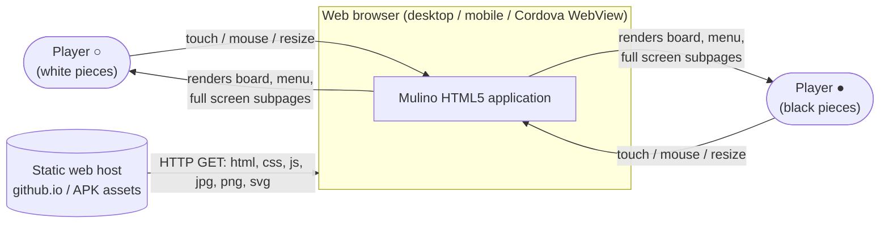

There is **no backend**. Both human players share one device ("hot seat"), or a
human plays against the built-in AI, or the AI plays against itself.

### 2.2 Deployment / artifact view

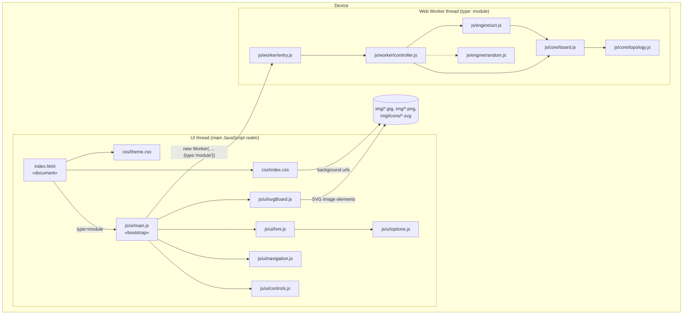

---

## 3. Component / package structure

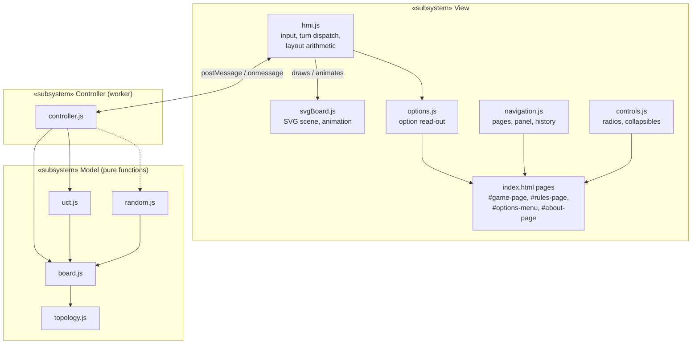

Dependency rule: the model has **no** knowledge of the view; the controller has
**no** DOM access (it cannot have — it runs in a worker). Rendering options
(`shown` / `hidden` toggles) are pure view concerns. They are included in the
request object produced by `readOptions()` but ignored by the worker; only
`flying`, `skipRemovalInMills`, `playerwhite` and `playerblack` affect worker behaviour.

---

## 4. Class diagram

There are no classes. The diagram shows the ES modules, the factory
functions they export (`«factory»`, closures holding the little state that has to
be mutable) and the pure functions (`«pure»`).

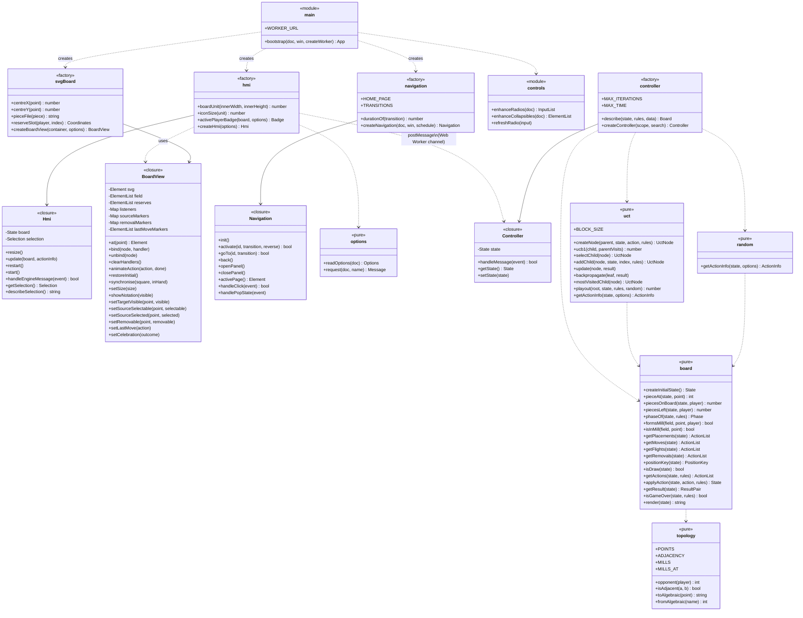

### 4.1 Model value objects

Every one of these is a plain, freely copyable value; nothing carries behaviour.

| Object | Shape | Meaning |
| --- | --- | --- |
| `Point` | integer `0..23` | index into `POINTS`; `POINTS[i]` is `{ x: 0..6, y: 0..6 }`, `x` = column `a`..`g`, `y` = row `1`..`7` |
| `Piece` | `WHITE` \| `BLACK` \| `null` | content of one point |
| `Phase` | `'placing'` \| `'moving'` \| `'flying'` \| `'removing'` | derived from the state for the side to move, never stored |
| `Action` | `{ type: 'place'\|'move'\|'fly'\|'remove', by, from?, to?, at? }` | `from` for move/fly, `to` for place/move/fly, `at` for remove |
| `State` | `{ field, active, inHand, pendingRemoval, history, previousAction }` | `field` has 24 entries, `inHand` is `[white, black]`, `history` is a linked list of position keys with their occurrence counts; the whole position, replaced on every action |
| `PositionKey` | string of `field` and `active` | identity of a position for the threefold-repetition rule |
| `Rules` | `{ flying: boolean, skipRemovalInMills: boolean }` | the rule variants offered by the Options page: flying ("optional in some rule sets") and skipping the removal when every opponent piece stands in a mill (default `false`) |
| `Board` | `{ square, turn, phase, inHand, actions, pendingRemoval, previous, nextishuman, outcome }` | the snapshot sent to the HMI; while `pendingRemoval` is set, `actions` contains only `remove` actions |
| `Outcome` | `{ winner: WHITE\|BLACK\|null, reason: 'fewer-than-three-pieces'\|'no-legal-move'\|'threefold-repetition' }` | terminal result used for the celebration; `winner` is `null` for a draw; `null` while play continues |
| `ActionInfo` | `{ action, info }` | chosen action plus a diagnostic string |

---

## 5. Model: rules realisation

The rule text of [doc/rules.md](rules.md) maps onto code as follows.

| Rule | Realisation |
| --- | --- |
| 24 points on three concentric squares connected by lines | `POINTS` and the symmetric `ADJACENCY` lists (32 edges) in `topology.js` |
| Algebraic notation `a1`..`g7`, only 24 valid names | `toAlgebraic()` / `fromAlgebraic()` over `POINTS` |
| 9 pieces per player | `inHand: [9, 9]` in `createInitialState()` |
| White starts | `active: WHITE` in `createInitialState()` |
| Phase 1: place one piece per turn on any empty point | `getPlacements()` while `inHand[active] > 0` |
| Mill = 3 own pieces in a row along a line | `MILLS` (16 triples); `formsMill(field, point, player)` checks only the two mills in `MILLS_AT[point]` |
| Forming a mill: the opponent **must** lose one piece | `applyAction()` keeps the turn and sets `pendingRemoval` whenever `getRemovals()` is non-empty; `getActions()` then returns only `getRemovals()` — there is no "pass" action |
| Two mills closed at once remove only one piece | a single `pendingRemoval` flag, cleared by the first `remove` |
| Pieces in a mill are protected unless no other piece is available | `getRemovals()` filters `isInMill()` and falls back to all opponent pieces when the filtered list is empty |
| Optional rule: skip the removal when every opponent piece stands in a mill | with `rules.skipRemovalInMills` the fallback list is empty, so `applyAction()` hands the turn over without `pendingRemoval` |
| Phase 2: slide to an adjacent empty point once all 18 pieces are placed | `getMoves()` when `inHand[active] === 0`; White starts, so both hands are empty at that point |
| A mill can be broken and reformed | emergent: the mill check runs on the destination point of every action and keeps no memory of earlier mills |
| Phase 3: flying with exactly 3 pieces, optional | `getFlights()` when `inHand[active] === 0`, `piecesOnBoard === 3` and `rules.flying` |
| Lose: fewer than 3 pieces | `piecesLeft()` (on board + in hand) `< 3` for the side to move; `getActions()` returns `[]` |
| Lose: no legal moves | `getActions().length === 0` at turn start; `getResult()` scores the side to move as the loser |
| Draw: same position for the third time, not necessarily consecutive, counted only once all pieces are placed | whenever the turn passes and both `inHand` entries are `0`, `applyAction()` prepends `positionKey(next)` to `history` with its occurrence count; `isDraw()` is true at `3`, `getActions()` returns `[]` and `getResult()` returns `[0.5, 0.5]` |

A position is the same when the same pieces stand on the same points and the
same player is to move — exactly the wording of rules.md. Positions are only
counted once all pieces have been placed, so `history` stays empty during the
placing phase. A removal makes every earlier position unreachable, so it starts
a fresh history. Intermediate states with a pending
removal are not counted, because a player at the physical board sees them only
as half of a turn. Since the number of positions is finite and each may occur at
most three times, every game — and every random playout of the engine — ends.

The topology tables are checked in `tests/unit/topology.test.js`: 24 points,
symmetric adjacency with 32 edges, 16 mills, every point in exactly two mills,
and every algebraic name round-trips.

### 5.1 Action generation — activity diagram

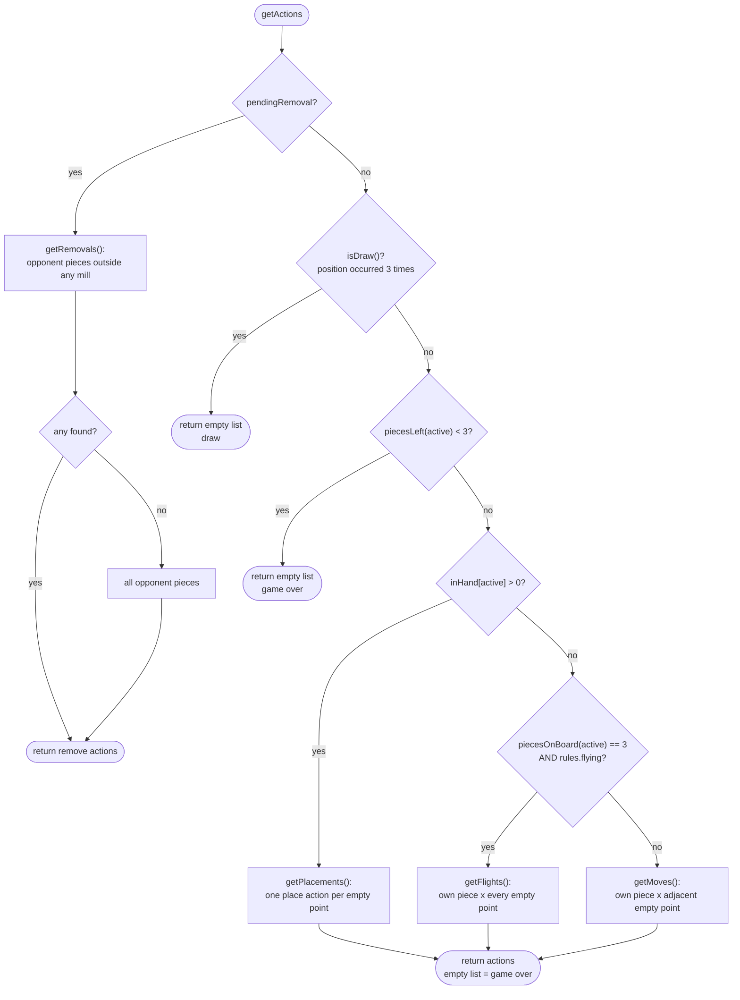

During placing there are always at least 6 empty points, so a placing player is
never blocked; *no legal move* can only occur in the moving phase. `pendingRemoval`
is only ever set when `getRemovals()` is non-empty (see 5.2), so the remove
branch never returns an empty list.

### 5.2 `applyAction` — state transition

`applyAction(state, action, rules)` needs the rules for the optional
removal-skip variant.

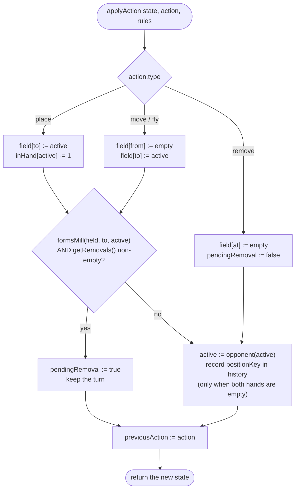

A turn that closes a mill therefore consists of **two** actions by the same
player — the place/move/fly followed by a remove — which is exactly the
notation `d7-g7xb2` of rules.md split at the `x`. With
`rules.skipRemovalInMills` and every opponent piece in a mill, `getRemovals()`
is empty and the mill-closing action alone ends the turn.

### 5.3 Game state machine

The states describe the side to move; every transition except the one into
*Removal pending* hands the turn to the opponent.

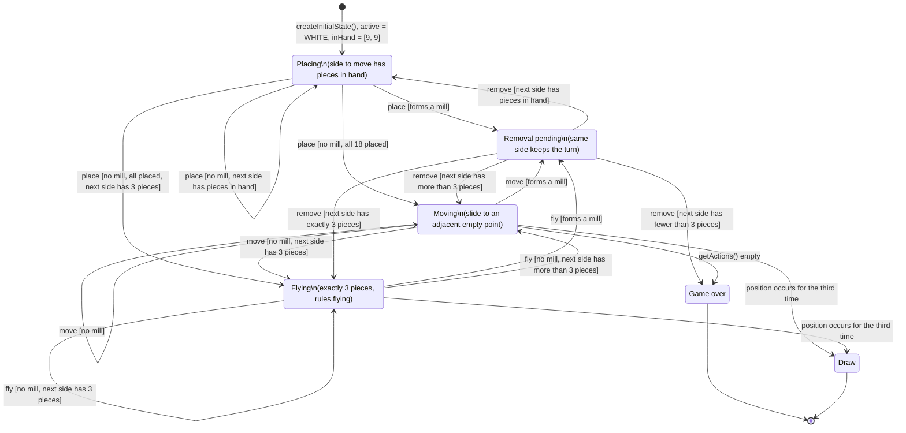

With `rules.flying === false` the *Flying* state is never entered; a player
with 3 pieces keeps sliding. A mill closed while every opponent piece stands
in a mill skips *Removal pending* when `rules.skipRemovalInMills` is set. A draw
is only reachable in the moving and flying phases, because repetitions are only
counted once all pieces have been placed.

### 5.4 UCT search — activity diagram

Overview only; the authoritative engine description, including the UCB1 formula,
the budget semantics and the known defects, is
[engine_mcts_ucb.md](engine_mcts_ucb.md).

```mermaid
flowchart TD
  A([getActionInfo state,<br/>maxIterations = 8000,<br/>maxTime = 5000 ms]) --> B["root := createNode(null, state, null, rules)"]
  B --> C{"iterations < 8000<br/>AND now < timeLimit?"}
  C -- no --> Z([return mostVisitedChild().action<br/>+ nodes/sec info])
  C -- yes --> D["block of 50 playouts"]
  D --> E["node := root<br/>variant := state"]
  E --> F{"node fully expanded<br/>AND has children?"}
  F -- yes --> G["node := selectChild(node)<br/>UCB1: w/n + sqrt(2 ln N / n)"]
  G --> H["variant := applyAction(variant, node.action, rules)"]
  H --> F
  F -- no --> I{"unexamined actions left?"}
  I -- yes --> J["pick random unexamined action<br/>applyAction, node := addChild(...)"]
  I -- no --> K
  J --> K["Simulation:<br/>random place / move / fly / remove actions<br/>until getActions() is empty (win or draw)"]
  K --> L["result := getResult(variant)"]
  L --> M["Backpropagation:<br/>walk to root, update(node, result)"]
  M --> C
```

`getResult()` returns `[1, 0]` when White is to move and `[0, 1]` when Black is
to move; since the side to move at a terminal position has fewer than 3 pieces
or *no* legal action, the entry set to `1` marks the **loser**. A threefold
repetition yields `[0.5, 0.5]`. Every node stores the `mover`, the player who
made the incoming action, and `update()` adds `1 - result[node.mover]`, i.e. how
often that action led to a win for the player who chose it — exactly the value
the parent maximises in `selectChild()`.

> After an action that closes a mill the mover does not change, because the
> same player still has to remove a piece. Storing the mover of the incoming
> edge, rather than the side to move at the node, keeps these mill-closing
> edges scored from the right perspective. See
> [engine_mcts_ucb.md](engine_mcts_ucb.md) section 2.4.

---

## 6. Runtime: message protocol between HMI and worker

### 6.1 Interface definition

**HMI → Controller** (`engine.postMessage`), discriminated by `class` /
`request`:

| `request` | Extra payload | Effect |
| --- | --- | --- |
| `start` | options | first render of the current state |
| `restart` | options | `createInitialState()`, then `restore` + `redraw` |
| `perform` | `action` | apply a human action (place, move, fly or remove), then `redraw` |
| `actionbyai` | options | let the AI pick and apply one action, then `redraw` |

Options carried on **every** request: `playerwhite`, `playerblack`
(`'Human'` \| `'AI'`), `flying` and `skipRemovalInMills` (`boolean`). They are read from the
Options page at send time, which implements the UI hint *"All selections will be
applied on next move or new game."* The two purely visual options
(`showavailablemove`, `showalgebraicnotation`) travel with the message as well
but are ignored by the worker.

Each request applies exactly **one** action. A turn that closes a mill thus
takes two round trips: the first `redraw` arrives with `pendingRemoval` set and
the same `turn`, the second request carries the `remove` action.

**Controller → HMI** (`self.postMessage`), discriminated by `eventClass` /
`request`:

| `request` | Payload | Effect |
| --- | --- | --- |
| `restore` | `board` | `view.restoreInitial()` |
| `redraw` | `board`, `actioninfo` | `hmi.update(board, actionInfo)` |

> Observation: the two directions use different discriminator property names
> (`class` outbound vs. `eventClass` inbound). This asymmetry of the original
> protocol was kept on purpose so that the message contract did not change.

### 6.2 Communication diagram (object message exchange)

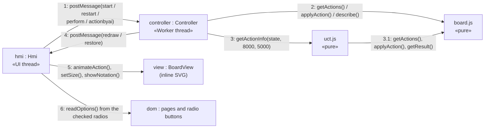

### 6.3 Sequence — application start

```mermaid
sequenceDiagram
  autonumber
  participant Browser
  participant DOM as index.html / plain DOM
  participant Hmi
  participant Paper as BoardView (inline SVG)
  participant W as Worker (Controller)
  participant Board as board.js

  Browser->>DOM: parse index.html, css/theme.css, css/index.css
  Browser->>Hmi: js/ui/main.js evaluated (type=module, deferred)
  Hmi->>Hmi: bootstrap()
  Hmi->>Paper: createBoardView(#board): svg viewBox 0 0 9 7
  Hmi->>Paper: board background, 16 lines, 24 dots, hidden notation labels
  Hmi->>Paper: 24 point elements + 18 reserve pieces (9 per side, off-board)
  Hmi->>Hmi: navigation.init(), enhanceRadios(), enhanceCollapsibles()
  Hmi->>Browser: addEventListener('resize', hmi.resize) ; resize()
  Hmi->>W: new Worker('js/worker/entry.js', {type:'module'})
  W->>Board: createInitialState()
  Hmi->>W: {class:'request', request:'start', options}
  W->>Board: getActions(state, rules)
  Board-->>W: action list
  W-->>Hmi: {eventClass:'request', request:'redraw', board, actioninfo:null}
  Hmi->>Hmi: update(board, null)
  alt board.nextishuman
    Hmi->>Paper: show a target on every empty point (placing phase)
  else AI to move
    Hmi->>W: {request:'actionbyai', options}
  end
```

### 6.4 Sequence — human turn (including mill and removal)

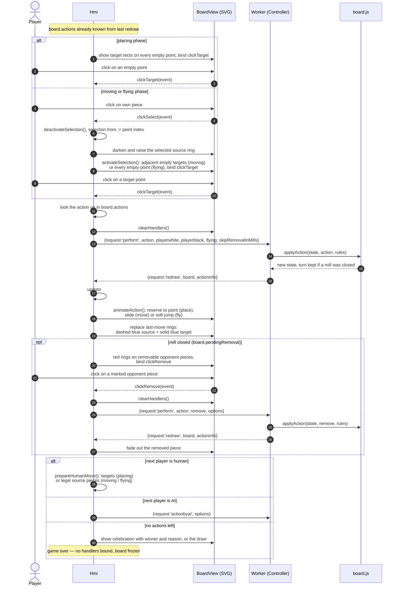

### 6.5 Sequence — AI move

```mermaid
sequenceDiagram
  autonumber
  participant Hmi
  participant W as Worker (Controller)
  participant Uct as uct.js
  participant Node as UctNode tree
  participant Board as board.js

  Hmi->>W: {request:'actionbyai', playerwhite, playerblack, flying, skipRemovalInMills}
  W->>Uct: getActionInfo(state, {maxIterations:8000, maxTime:5000, rules})
  Uct->>Node: root := createNode(null, state, null, rules)
  loop until 8000 iterations or 5000 ms (blocks of 50)
    Uct->>Node: selectChild() (UCB1) — Selection
    Uct->>Node: addChild(...) — Expansion
    Uct->>Board: random applyAction() until getActions() empty — Simulation
    Uct->>Board: getResult()
    Uct->>Node: update(result) up to the root — Backpropagation
  end
  Uct-->>W: {action: mostVisitedChild(root).action, info: 'n nodes/sec examined.'}
  W->>Board: applyAction(state, action, rules)
  W-->>Hmi: {request:'redraw', board, actioninfo}
  Hmi->>Hmi: update() → animation → next turn dispatch
  Note over Hmi: UI thread stays responsive during the whole search;<br/>menu and subpages remain usable
```

When the AI closes a mill, the `redraw` carries `pendingRemoval` with
`nextishuman === false`, so the HMI immediately sends a second `actionbyai`;
the AI's removal is searched and animated as an action of its own.

Search internals (selection, expansion, simulation, backpropagation, budget
handling) are documented in [engine_mcts_ucb.md](engine_mcts_ucb.md).

### 6.6 Sequence — new game

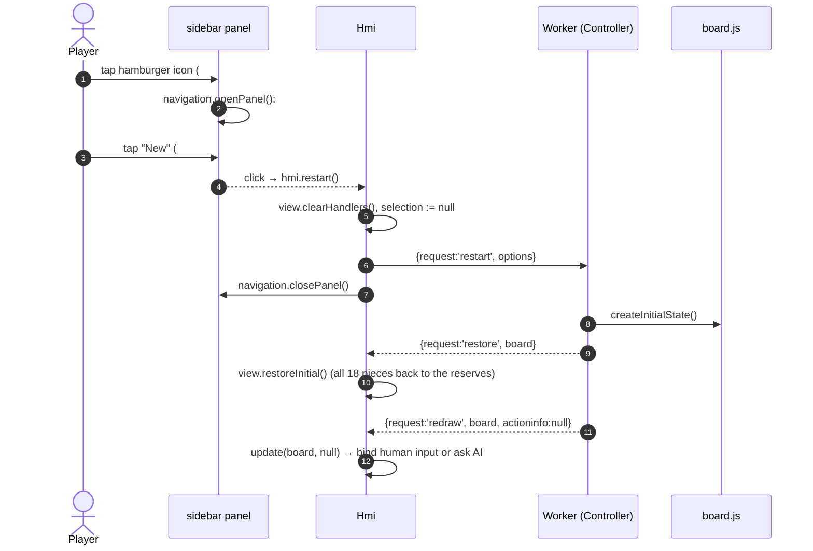

---

## 7. Use cases

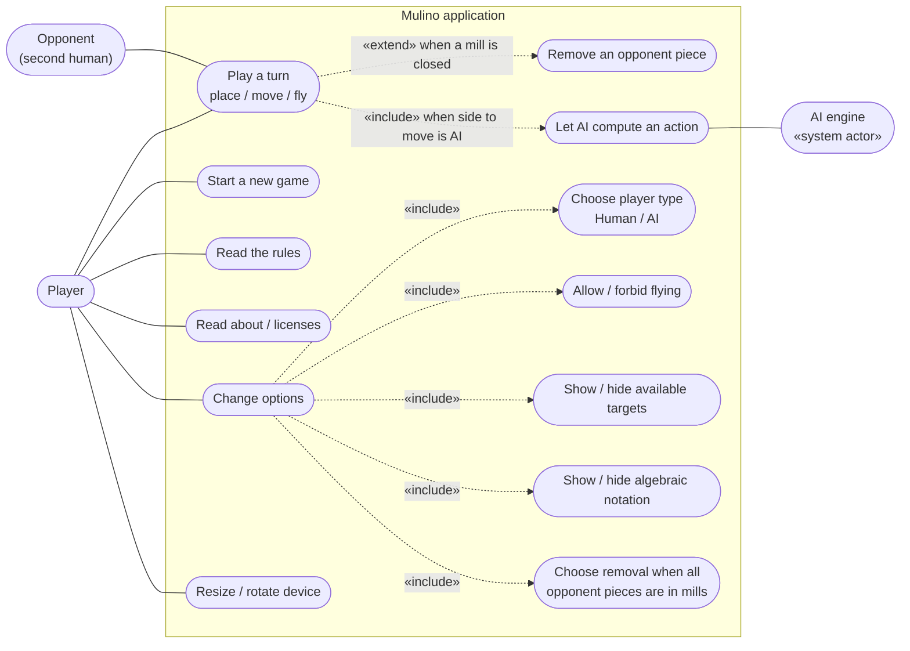

### 7.1 Use case "Play a turn" (human)

| Item | Description |
| --- | --- |
| Actor | Player whose colour is configured as `Human` |
| Precondition | `board.nextishuman == true`, i.e. it is that colour's turn and at least one legal action exists |
| Trigger | Placing: tap/click on a highlighted empty point. Moving / flying: tap/click on one of the highlighted-source pieces |
| Main flow | 1. Placing: the target is selected directly. Moving / flying: select source → adjacent (moving) or all empty (flying) targets become clickable, then select target. 2. HMI matches the choice against `board.actions` and posts it as `perform`. 3. Worker applies it and answers `redraw`. 4. HMI animates. 5. Turn passes, or — if a mill was closed — the same player continues with *Remove an opponent piece*. |
| Alternative | Selecting a different source before a target: `deactivateSelection()` removes the old target bindings first. |
| Postcondition | Board rendered in the new state; input handlers bound for whoever acts next. |
| Exception | No action list entry matches → nothing is posted; the board keeps waiting. |

### 7.2 Use case "Remove an opponent piece" (human)

| Item | Description |
| --- | --- |
| Precondition | `board.pendingRemoval == true` and `board.nextishuman == true` |
| Main flow | 1. Removable opponent pieces get red rings. 2. Player taps one. 3. HMI posts the `remove` action. 4. Worker applies it, hands the turn over and answers `redraw`. 5. HMI fades the piece out. |
| Business rule | Removal is compulsory, one piece even when two mills were closed. Pieces in a mill are only offered when the opponent has no piece outside a mill; with the optional rule `skipRemovalInMills` that case removes nothing and this use case is not entered. |
| Postcondition | Opponent to move, celebration if the opponent is down to fewer than 3 pieces, or a draw announcement if the resulting position occurred for the third time. |

---

## 8. HMI internal structure and navigation

This is the part the user interacts with most, so it is documented in detail.

### 8.1 Composite structure of the game page

`#game-page` uses border-box sizing and a height of `100vh`, upgraded to
`100dvh` in browsers that support dynamic viewport units. The fixed-header
padding is therefore included in the viewport height. Overflow is hidden on the
game page only, removing browser scrollbars while Rules and About remain
scrollable. The textured background covers the complete visible viewport.

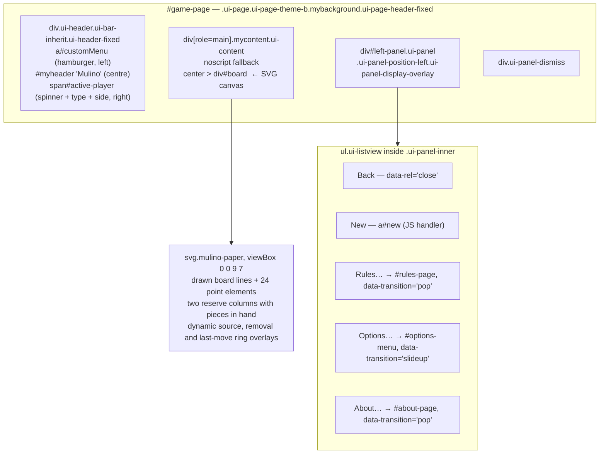

### 8.2 Sidebar menu and full-screen subpages

`index.html` contains **four** elements with class `ui-page`:
`#game-page`, `#rules-page`, `#options-menu`, `#about-page`.

[navigation.js](../html5/src/js/ui/navigation.js) shows **exactly one page at a
time**: the active page carries `ui-page-active`, every other one is
`display: none` through `.ui-page`. Therefore navigating from the sidebar to
*Rules…*, *Options…* or *About…*:

1. hides `#game-page` **including the whole `#board` SVG canvas** — the game
   board is not merely covered, it is removed from the visual flow, so the
   subpage is genuinely full screen;
2. shows the requested subpage with the configured transition
   (`pop` for Rules and About, `slideup` for Options), by adding the animation
   classes `<transition> in` to the incoming and `<transition> out` to the
   outgoing page and stripping them again after the animation;
3. pushes a history entry (`history.pushState`, hash `#<page id>`), so the
   hardware/browser Back button works.

Returning is always a **back navigation** (`data-rel='back'` →
`history.back()`), never a forward link. Each subpage offers two equivalent ways
back:

* the round icon button in the header (`#customBackRules`, `#customBackOptions`
  — labelled *Close*, `#customBackAbout`), and
* a full-width button at the very bottom of the content (*Back* / *Ok*).

The `popstate` handler activates the page named in the history entry, or
`#game-page` when there is none, and replays the transition in reverse. The
board becomes visible in exactly the state it was left in — the SVG DOM is never
torn down, and no engine message is exchanged. The worker keeps the
authoritative game state, so the game cannot be disturbed by navigating away; an
AI search that is running continues undisturbed in the worker while a subpage is
open.

The sidebar panel itself is an **overlay panel**, not a page: it slides over
`#game-page` and is closed either by the *Back* item (`data-rel='close'`), by
tapping the dismiss layer outside it, or programmatically when *New* is chosen.

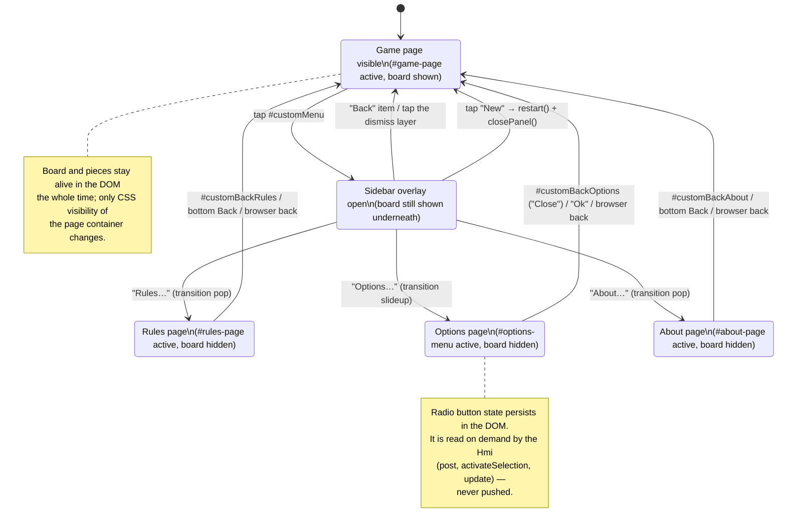

### 8.3 Navigation activity — leaving and re-entering a subpage

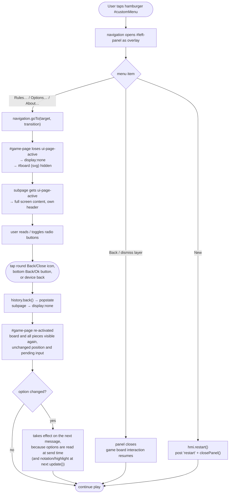

### 8.4 Where each option is consumed

| Option (DOM id) | Read in | Consumed by |
| --- | --- | --- |
| `#playerwhiteai`, `#playerblackai` | `readOptions()` on every `post()` and `update()` | `describe()` → `board.nextishuman`; `activePlayerBadge()` → title-bar symbol and label |
| `#flyingAllowed` | `readOptions()` on every `post()` | `toRules()` → `rules.flying` |
| `#skipRemovalInMills` | `readOptions()` on every `post()` | `toRules()` → `rules.skipRemovalInMills`; default unchecked (take a piece from a mill) |
| `#showavailablemove` | `activateSelection()` | opacity of the target rectangles (`0.4` vs. `0`) |
| `#showalgebraicnotation` | `update()` | `view.showNotation()` shows or hides the column and row labels |

Consequence of this pull-based design: the two *rendering* options act on the
next repaint or selection, the three *engine* options act on the next message —
matching the hint text *"All selections will be applied on next move or new
game."* on the Options page.

On every `redraw`, `activePlayerBadge()` combines `board.turn` with the current
player-type options. The right-aligned badge displays `🧑○` or `🤖○` for
`Player ○` (White) and `🧑●` or `🤖●` for `Player ●` (Black), followed by
the number of pieces still in hand during the placing phase and a scissors
hint `✂` while a removal is pending. Its `aria-label` and tooltip
provide the equivalent textual description. A small
CSS-animated spinner sits to the left of the symbol and is marked
`aria-hidden` because it is purely decorative. The compact status span has a
dark background, rounded light-orange border and horizontal padding.

`BoardView` owns three independent visual marker sets. `sourceMarkers` contains
the light-green rings for legal human move origins (moving and flying phase
only; in the placing phase the empty points are offered directly as targets).
Selecting one darkens it and moves its circle to the end of the SVG child list,
which is the SVG equivalent of raising its z-index. `removalMarkers` contains
the red rings around opponent pieces that may be removed while
`board.pendingRemoval` is set; pieces protected by a mill stay unmarked unless
no other piece is available. `lastMoveMarkers` contains a light-blue dashed
source ring and solid target ring at half the green stroke width; a placement
has a target ring only, a removal leaves the previous pair in place. The blue
pair is replaced after each completed animation and removed by `restore`.

Pieces in hand are drawn in the two reserve columns left (White) and right
(Black) of the board. A placement animates the topmost reserve piece onto its
point, so the remaining count is always visible on the board itself.

The board container also owns `.winning-celebration`, an HTML status overlay
fixed immediately below the title bar and horizontally centred over the SVG.
`hmi.resize()` publishes the responsive control height through
`--game-title-bar-height`, leaving a small stable gap below the title controls.
A terminal board snapshot carries
the winning side and either `fewer-than-three-pieces` or `no-legal-move`, or
`winner: null` with `threefold-repetition`, in which case the panel announces a
draw instead of congratulating a winner. The HMI
reveals the panel after the final move animation, or immediately for a terminal
redraw without an action. `restore` hides it. The panel uses 70 % opacity,
rounded corners and a thin light-orange border.

### 8.5 Responsive layout

`hmi.resize()` is bound to `window.resize` and additionally called at the start
of every `update()`:

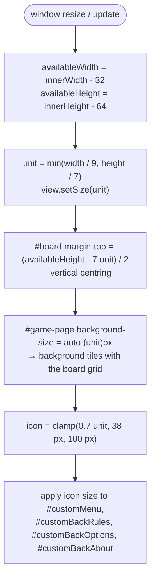

Because the SVG canvas uses `viewBox="0 0 9 7"` — a 7 × 7 board grid plus one
reserve column on each side — all board geometry is expressed in board units
and scaling is free of layout maths: a piece at model point `POINTS[i] = (x, y)`
is centred at `(x + 1.5, 6.5 - y)` with size `0.7 × 0.7`. The `6.5 - y` term
(`centreY()`) is the single place where the model's bottom-up row numbering
(rows `1`..`7` of rules.md) is flipped to the screen's top-down y axis. Only 24
of the 49 grid cells are points; the other 25 carry no element.

---

## 9. Cross-cutting concerns

### 9.1 Threading and responsiveness

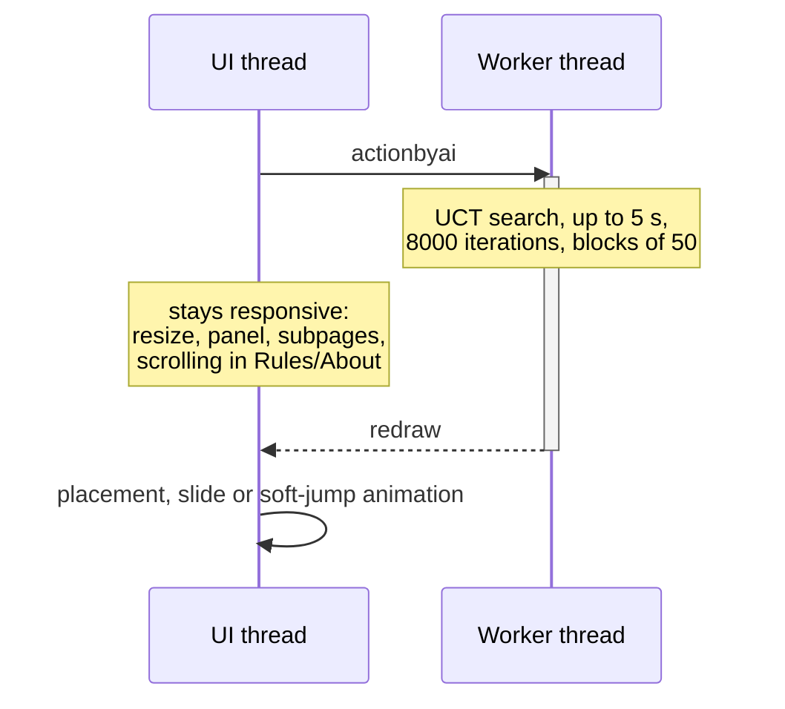

The worker is created once in `bootstrap()` and lives for the whole session; it
is never terminated or restarted, so the model reference is stable and `restart`
is a message rather than a re-creation.

### 9.2 Input safety

* Only points that appear in the last received `board.actions` list get click
  handlers — empty points while placing, light-green source rings while
  moving or flying, red removal rings while a removal is pending — so illegal
  input is structurally impossible from the UI.
* `clickTarget()` and `clickRemove()` clear **all** handlers before posting, so
  a single action cannot be submitted twice.
* The view keeps its own `Map` of bound listeners, so `unbind()` and
  `clearHandlers()` can remove exactly the handlers that were added.
* The HMI sends an action object selected from the legal actions supplied by the
  worker in the previous `redraw`. The worker owns the state but currently
  trusts this payload rather than validating it against freshly generated legal
  actions.

### 9.3 Testing

| Layer | Tool | Location |
| --- | --- | --- |
| Rules, engine, controller, UI modules | Vitest (+ jsdom for the DOM modules) | [tests/unit](../tests/unit) |
| Whole application in a real browser | Playwright (Chromium) | [tests/e2e](../tests/e2e) |

`npm run coverage` enforces 96 % statement, branch, function and line coverage
over `html5/src/js/**`. `npm run test:e2e` serves `html5/src` with
[tools/serve.js](../tools/serve.js) and drives the real UI: menu, all three
subpages including the hidden/visible board, options, a placement that closes
a mill followed by a removal, protection of pieces in a mill, the transition to
the moving phase, flying with three pieces, both removal variants when every
opponent piece stands in a mill, a threefold-repetition draw, active-player
badge and spinner,
source-selection, removal and last-move highlights, and a new game.

Testability shaped the design: the model is pure, `uct.getActionInfo` takes
`random` and `now`, the board view takes `schedule`, and the navigation takes
`schedule` too, so unit tests do not have to wait for timers. The browser suite
uses real time where it verifies CSS transition interpolation.

### 9.4 Known gaps

| Item | Location | Effect |
| --- | --- | --- |
| `actionInfo.info` is not displayed | `hmi.update` | the nodes/sec figure is computed but never shown |
| `'response'` message class unused | both sides | reserved extension point |
| `Random` engine not wired to a request | `controller.js` | the alternative provider exists but is not selectable |
| Repetition bookkeeping cost | `applyAction` | finding the occurrence count walks `history` back to the last occurrence or removal; long moving phases in random playouts pay for it |
| No difficulty setting | `controller.js` | budget hard-coded to `(8000, 5000)` for both sides |
| Human action payload not revalidated | `controller.perform` | direct callers of the worker protocol are trusted to send an action from the previous `redraw` |

---

## 10. Traceability: rules ↔ architecture ↔ UI

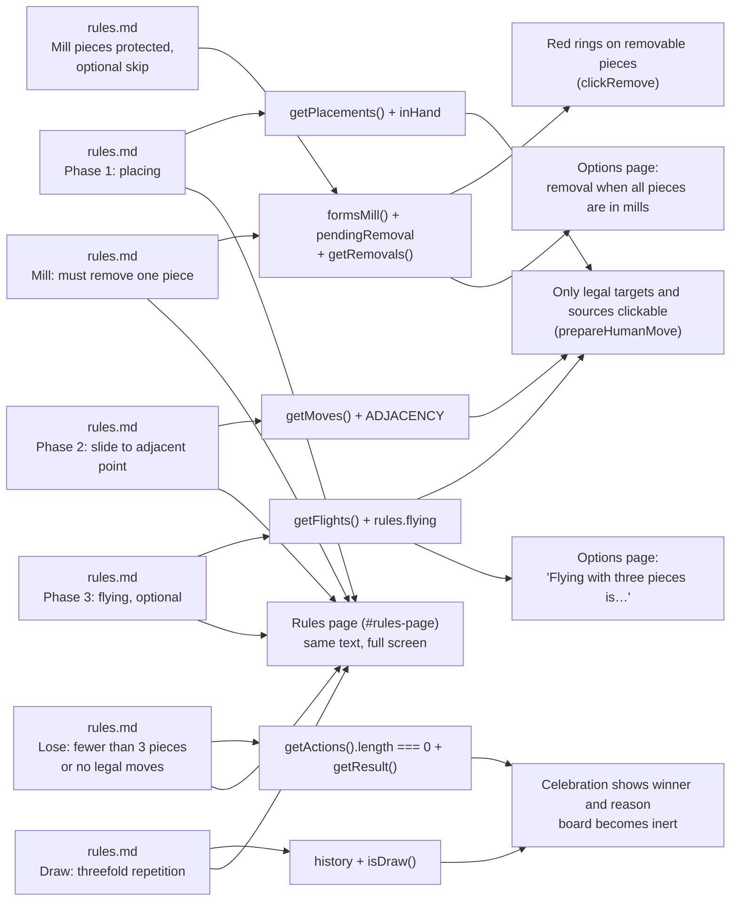

The Rules subpage duplicates the rule text of [doc/rules.md](rules.md) as inline
HTML so that the application stays fully self-contained and usable offline.
